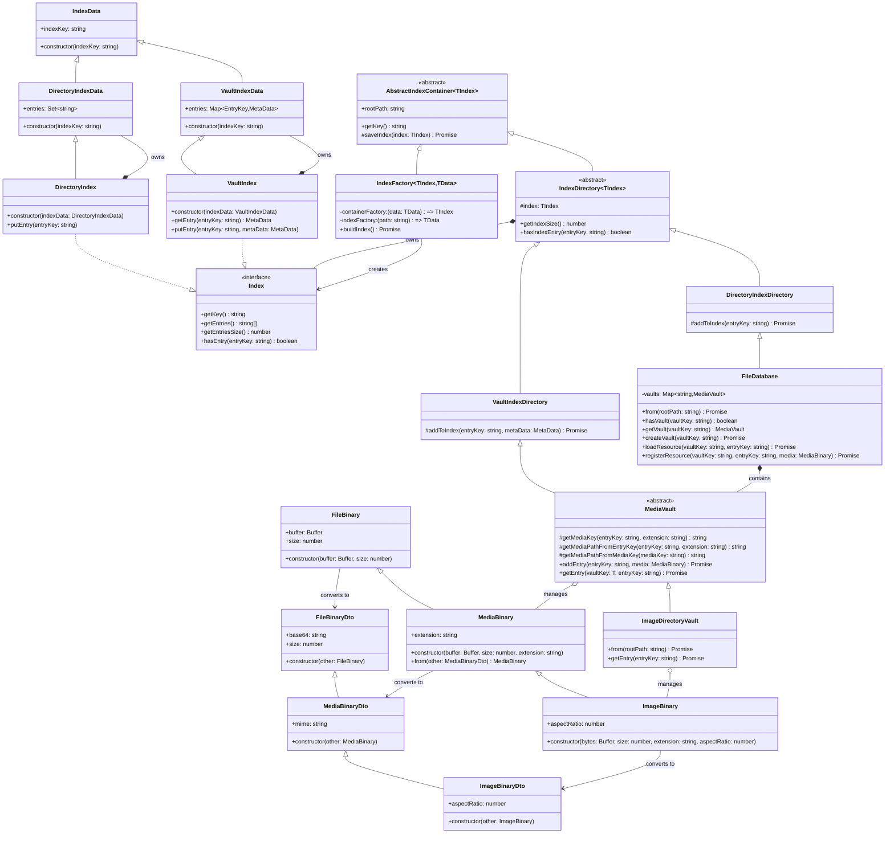

```mermaid
classDiagram
    %% Base Classes and Interfaces
    class Index {
        <<interface>>
        +getKey() string
        +getEntries() string[]
        +getEntriesSize() number
        +hasEntry(entryKey: string) boolean
    }
    
    class IndexData {
        +indexKey: string
        +constructor(indexKey: string)
    }

    class AbstractIndexContainer~TIndex~ {
        <<abstract>>
        +rootPath: string
        +getKey() string
        #saveIndex(index: TIndex) Promise
    }

    %% File Binary Classes
    class FileBinary {
        +buffer: Buffer
        +size: number
        +constructor(buffer: Buffer, size: number)
    }

    class FileBinaryDto {
        +base64: string
        +size: number
        +constructor(other: FileBinary)
    }

    class MediaBinary {
        +extension: string
        +constructor(buffer: Buffer, size: number, extension: string)
        +from(other: MediaBinaryDto) MediaBinary
    }

    class MediaBinaryDto {
        +mime: string
        +constructor(other: MediaBinary)
    }

    class ImageBinary {
        +aspectRatio: number
        +constructor(bytes: Buffer, size: number, extension: string, aspectRatio: number)
    }

    class ImageBinaryDto {
        +aspectRatio: number
        +constructor(other: ImageBinary)
    }

    %% Index Classes
    class DirectoryIndexData {
        +entries: Set~string~
        +constructor(indexKey: string)
    }

    class DirectoryIndex {
        +constructor(indexData: DirectoryIndexData)
        +putEntry(entryKey: string)
    }

    class VaultIndexData {
        +entries: Map~EntryKey,MetaData~
        +constructor(indexKey: string)
    }

    class VaultIndex {
        +constructor(indexData: VaultIndexData)
        +getEntry(entryKey: string) MetaData
        +putEntry(entryKey: string, metaData: MetaData)
    }

    %% Directory Classes
    class IndexDirectory~TIndex~ {
        <<abstract>>
        #index: TIndex
        +getIndexSize() number
        +hasIndexEntry(entryKey: string) boolean
    }

    class DirectoryIndexDirectory {
        #addToIndex(entryKey: string) Promise
    }

    class VaultIndexDirectory {
        #addToIndex(entryKey: string, metaData: MetaData) Promise
    }

    %% MediaVault Classes
    class MediaVault {
        <<abstract>>
        #getMediaKey(entryKey: string, extension: string) string
        #getMediaPathFromEntryKey(entryKey: string, extension: string) string
        #getMediaPathFromMediaKey(mediaKey: string) string
        +addEntry(entryKey: string, media: MediaBinary) Promise
        +getEntry(vaultKey: T, entryKey: string) Promise
    }

    class ImageDirectoryVault {
        +from(rootPath: string) Promise
        +getEntry(entryKey: string) Promise
    }

    %% Factory Class
    class IndexFactory~TIndex,TData~ {
        -containerFactory: (data: TData) => TIndex
        -indexFactory: (path: string) => TData
        +buildIndex() Promise
    }

    %% Main Database Class
    class FileDatabase {
        -vaults: Map~string,MediaVault~
        +from(rootPath: string) Promise
        +hasVault(vaultKey: string) boolean
        +getVault(vaultKey: string) MediaVault
        +createVault(vaultKey: string) Promise
        +loadResource(vaultKey: string, entryKey: string) Promise
        +registerResource(vaultKey: string, entryKey: string, media: MediaBinary) Promise
    }

    %% Inheritance Relationships (Existing)
    FileBinary <|-- MediaBinary
    MediaBinary <|-- ImageBinary
    FileBinaryDto <|-- MediaBinaryDto
    MediaBinaryDto <|-- ImageBinaryDto
    
    IndexData <|-- DirectoryIndexData
    IndexData <|-- VaultIndexData
    DirectoryIndexData <|-- DirectoryIndex
    VaultIndexData <|-- VaultIndex
    DirectoryIndex ..|> Index
    VaultIndex ..|> Index
    
    AbstractIndexContainer <|-- IndexFactory
    AbstractIndexContainer <|-- IndexDirectory
    IndexDirectory <|-- DirectoryIndexDirectory
    IndexDirectory <|-- VaultIndexDirectory
    
    VaultIndexDirectory <|-- MediaVault
    MediaVault <|-- ImageDirectoryVault
    
    DirectoryIndexDirectory <|-- FileDatabase

    %% Composition Relationships (Strong "has-a")
    FileDatabase *-- MediaVault : contains
    IndexDirectory *-- Index : owns
    DirectoryIndex *-- DirectoryIndexData : owns
    VaultIndex *-- VaultIndexData : owns

    %% Aggregation Relationships (Weak "has-a")
    MediaVault o-- MediaBinary : manages
    ImageDirectoryVault o-- ImageBinary : manages

    %% Association Relationships (Uses)
    FileBinary --> FileBinaryDto : converts to
    MediaBinary --> MediaBinaryDto : converts to
    ImageBinary --> ImageBinaryDto : converts to
    IndexFactory --> Index : creates
```