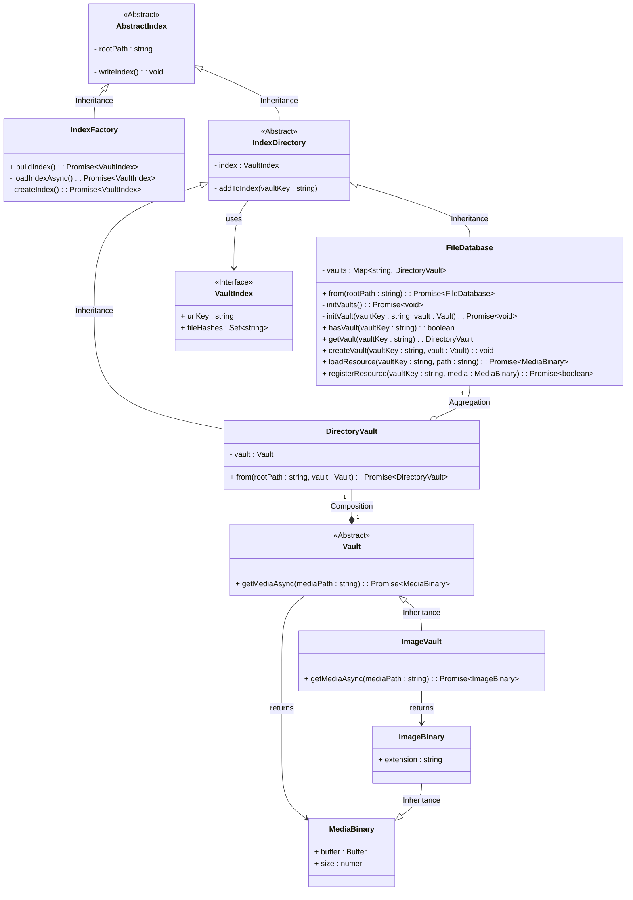

```mermaid
    classDiagram

    %% Abstract Class - IndexDirectory
    class AbstractIndex {
        <<Abstract>>
        - rootPath : string
        - writeIndex() : void
    }

    class IndexFactory {
        + buildIndex() : Promise~VaultIndex~
        - loadIndexAsync() : Promise~VaultIndex~
        - createIndex() : Promise~VaultIndex~
    }

    %% Abstract Class - IndexDirectory
    class IndexDirectory {
        <<Abstract>>
        - index : VaultIndex
        - addToIndex(vaultKey : string)
    }

    %% Class - FileDatabase
    class FileDatabase {
        - vaults : Map~string, DirectoryVault~
        + from(rootPath : string) : Promise~FileDatabase~
        - initVaults() : Promise~void~
        - initVault(vaultKey : string, vault : Vault) : Promise~void~
        + hasVault(vaultKey : string) : boolean
        + getVault(vaultKey : string) : DirectoryVault
        + createVault(vaultKey : string, vault : Vault) : void
        + loadResource(vaultKey : string, path : string) : Promise~MediaBinary~
        + registerResource(vaultKey : string, media : MediaBinary) : Promise~boolean~
    }

    %% Class - DirectoryVault
    class DirectoryVault {
        - vault : Vault
        + from(rootPath : string, vault : Vault) : Promise~DirectoryVault~
    }

    %% Abstract Class - Vault
    class Vault {
        <<Abstract>>
        + getMediaAsync(mediaPath : string) : Promise~MediaBinary~
    }

    %% Class - ImageVault
    class ImageVault {
        + getMediaAsync(mediaPath : string) : Promise~ImageBinary~
    }

    %% Interface - VaultIndex
    class VaultIndex {
        <<Interface>>
        + uriKey : string
        + fileHashes : Set~string~
    }

    %% External Class - MediaBinary
    class MediaBinary {
        + buffer : Buffer
        + size : numer
    }

    %% External Class - ImageBinary
    class ImageBinary {    
        + extension : string
    }

    %% Relationships
    AbstractIndex <|-- IndexDirectory : Inheritance
    AbstractIndex <|-- IndexFactory : Inheritance
    IndexDirectory <|-- FileDatabase : Inheritance
    IndexDirectory <|-- DirectoryVault : Inheritance
    FileDatabase "1" --o "1..*" DirectoryVault : Aggregation
    DirectoryVault "1" --* "1" Vault : Composition
    Vault <|-- ImageVault : Inheritance
    IndexDirectory --> VaultIndex : uses
    Vault --> MediaBinary : returns
    ImageVault --> ImageBinary : returns
    ImageBinary --|> MediaBinary : Inheritance
```